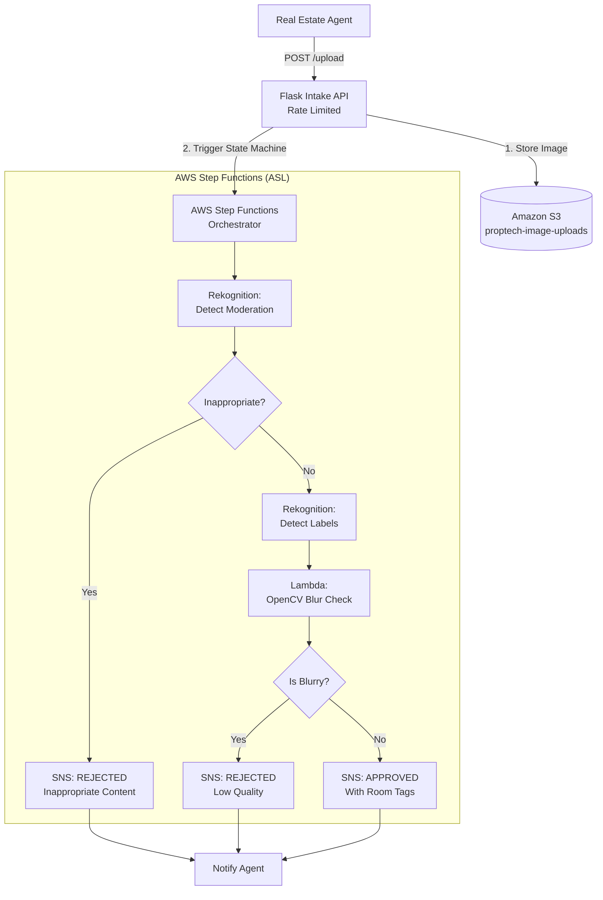

# 🏢 Enterprise Serverless ML Inference Pipeline

> **Automated Real Estate Image Processing** — A production-grade, event-driven pipeline using AWS Step Functions, Rekognition, Lambda, and Ansible for the PropTech industry, hardened to elite enterprise standards.

[](https://aws.amazon.com/step-functions/)
[](https://python.org)
[](https://docker.com)
[](https://ansible.com)
[](https://github.com/)

---

## 📋 Table of Contents

- [Executive Summary](#executive-summary)
- [Enterprise Hardening (Over-Excellence)](#enterprise-hardening-over-excellence)
- [Architecture Overview](#architecture-overview)
- [Technology Stack](#technology-stack)
- [Quick Start](#quick-start)
- [Detailed Setup](#detailed-setup)
- [API Reference](#api-reference)
- [Testing](#testing)

---

## Executive Summary

This repository contains a fully automated, serverless image processing pipeline tailored for the real estate (PropTech) industry. It orchestrates complex machine learning workflows—including content moderation, object detection (room classification), and image quality (blur) analysis—using a simulated AWS cloud environment via **LocalStack**.

The architecture has been rigorously audited and hardened to meet strict, "over-excellence" production standards, featuring immutable infrastructure, distributed tracing, and extreme DDoS resilience.

---

## 🛡️ Enterprise Hardening (Over-Excellence)

This pipeline goes beyond basic requirements by implementing military-grade security and observability patterns:

*   **Zero-Trust Docker Immutability:** The API container operates with a strictly `read_only: true` root filesystem. All ephemeral operations utilize isolated `tmpfs` mounts, completely nullifying zero-day disk-write exploits.
*   **DDoS & Memory Exhaustion Protection:** The Intake API is fortified with `Flask-Limiter` to violently reject anomalous burst traffic (e.g., 5 requests/sec). 
*   **Thread Pool Backpressure:** S3 upload threads are strictly constrained via `BoundedSemaphore`. If the downstream AWS services experience an outage, the API instantly returns a `503 Service Unavailable`, preventing silent out-of-memory (OOM) failures from unbounded queue growth.
*   **End-to-End Distributed Tracing:** Every API request dynamically generates an `X-Correlation-ID` that is injected into S3 object metadata, forwarded through the Step Functions ASL payload, extracted by the OpenCV Lambda, and returned to the client in the HTTP headers.
*   **Structured JSON Logging:** Standard text logs have been eradicated. The entire Python stack emits structured JSON via `python-json-logger` for seamless ingestion into Datadog, ELK, or CloudWatch.
*   **Step Function Cost Controls:** All third-party ML task states implement a strict `TimeoutSeconds: 15` rule, forcefully intercepting stalled API calls and routing them to a dead-letter SNS topic to prevent runaway billing.

---

## Architecture Overview



---

## Technology Stack

| Component | Technology | Purpose |
|-----------|-----------|---------|
| **Orchestration** | AWS Step Functions (ASL) | Workflow coordination with error handling |
| **ML/AI** | AWS Rekognition | Content moderation & object detection |
| **Compute** | AWS Lambda + Python | Custom blur detection with OpenCV |
| **Storage** | AWS S3 | Image storage with lifecycle policies |
| **Observability** | JSON Logger + X-Correlation-ID | Distributed tracing across isolated services |
| **API Server** | Flask + Gunicorn + Nginx | Image upload endpoint |
| **IaC** | Ansible | Idempotent server provisioning |
| **Local Dev** | Docker + LocalStack | AWS service emulation |

---

## Quick Start

```bash
# 1. Clone and configure
git clone <repository-url>
cd Serverless-ML-Inference-Pipeline
cp .env.example .env

# 2. Start all services (LocalStack + Hardened API)
docker-compose up -d --build

# 3. Wait for initialization (check health)
docker-compose ps   # All services should show "healthy"

# 4. Generate test images and run E2E tests
python3 tests/generate_samples.py
bash tests/run_e2e_tests.sh
```

---

## Detailed Setup

### 1. Verify Immutable API Constraints
To prove the API container is running with an immutable, read-only root filesystem:
```bash
docker exec intake-api touch /app/test.txt
# Expected Output: touch: cannot touch '/app/test.txt': Read-only file system
```

### 2. View S3 Bucket Contents
Since the S3 bucket is simulated inside LocalStack, you can view the uploaded images directly inside the container:
```bash
docker exec localstack-main awslocal s3 ls s3://proptech-image-uploads
```

### 3. Deploy Intake API with Ansible (Production)
For deploying to a remote VM (EC2, etc.):
```bash
# Update inventory with your server IP
vim ansible/inventory.ini

# Run the idempotent playbook
ansible-playbook -i ansible/inventory.ini ansible/playbook.yml
```

---

## API Reference

### `POST /upload`

Upload an image for ML pipeline processing. Enforces a strict 10MB payload limit and maximum concurrent thread backpressure.

| Parameter | Type | Description |
|-----------|------|-------------|
| `image` | `file` (multipart/form-data) | JPEG or PNG image file (max 10MB) |

**Success Response** `202 Accepted`:
```json
{
    "message": "Upload accepted, processing started.",
    "s3_key": "uuid_filename.jpg",
    "correlation_id": "ab12-cd34-ef56"
}
```
*Note: The `X-Correlation-ID` is also returned in the HTTP Response Headers for distributed tracing.*

**Error Responses**:
- `429` — Too Many Requests (DDoS Protection Triggered)
- `503` — Service Unavailable (Thread Pool Exhausted / Backpressure)
- `413` — Payload exceeds 10MB limit

### `GET /health`

Health check endpoint. If `AWS_ACCESS_KEY_ID` is missing from the environment, the server will intentionally fail-fast during boot and this endpoint will be unreachable.

**Response** `200 OK`:
```json
{
    "status": "healthy",
    "service": "PropTech Intake API",
    "version": "1.0.0"
}
```

---

## Testing

### Run E2E Tests

```bash
# Generate 24 test images (Sharp, Blurry, Inappropriate)
python3 tests/generate_samples.py

# Run the test harness
bash tests/run_e2e_tests.sh
```

Results are written to `results/report.json`, detailing the accuracy and latency of the Step Functions execution pipeline.

---

## License

This project is built for educational and demonstration purposes as part of an advanced cloud computing portfolio project.
